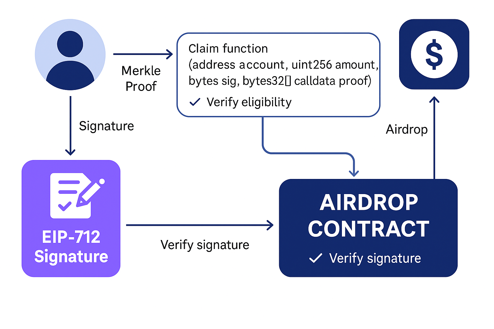

# 🪂 Airdrop Token System with EIP-712 & Merkle Tree Whitelisting

> A secure, gas-optimized airdrop smart contract built with Solidity that uses EIP-712 for off-chain signature verification and Merkle Trees for scalable whitelisting.

---

## 📸 Demo Flow (Architecture)

 

---

## 📦 Features

- ✅ EIP-712 typed structured signatures for off-chain whitelisting
- 🌲 Merkle Tree proof verification for scalable claims (`O(log N)`)
- 🔒 Signature replay protection
- 🔄 One-time claim enforcement
- ⛽ Gas-optimized design

---

## 📚 Tech Stack

- **Solidity** for smart contracts  
- **Foundry** for testing and deployment  
  
- **Merkle Tree JS utilities** for generating proofs  
- **EIP-712 Typed Data Signatures**

---

## 📂 Project Structure

```
├── contracts
│   └── Airdrop.sol
├── scripts
│   └── DeployMerkleAirDrop.s.sol / Interact.s.sol
├── test
│   └── MerkleAirDrop.t.sol
├── assets
│   └── airdrop.png
└── README.md
```

---

## 🚀 How It Works

1. Off-chain, a list of eligible addresses and airdrop amounts is created.
2. A Merkle Tree is generated using this list.
3. Each user signs a claim message using **EIP-712**.
4. The user sends a transaction with:
   - Their address and claim amount
   - EIP-712 signature
   - Merkle proof
5. The smart contract verifies:
   - The Merkle proof is valid
   - The signature matches the typed data
   - The user hasn’t claimed before
6. Tokens are transferred securely 🎉

---

## 🔧 Setup Instructions

1. Clone the repo:
   ```bash
   git clone https://github.com/DakshMane/AirDropContract
   cd merkle-airdrop
   ```

2. Install dependencies:
   ```bash
   npm install
   ```

3. Compile contracts:
   ```bash
   forge build
   ```

4. Run tests:
   ```bash
        forge test
   ```

---

## 📄 Example Claim Function

```solidity
function claim(address account, uint256 amount, bytes calldata sig, bytes32[] calldata merkleProof) external {
    require(!claimed[account], "Already claimed");

    // Verify Merkle proof
    bytes32 node = keccak256(abi.encodePacked(account, amount));
    require(MerkleProof.verify(merkleProof, merkleRoot, node), "Invalid proof");

    // Verify EIP-712 signature
    require(verifySignature(account, amount, sig), "Invalid signature");

    claimed[account] = true;
    token.transfer(account, amount);
}
```

---

## 🤝 Contributing

PRs and feedback welcome! If you found this useful or learned something, feel free to give it a ⭐

---

## 🧠 Learn More

- [EIP-712 Documentation](https://eips.ethereum.org/EIPS/eip-712)
- [Merkle Trees in Ethereum](https://blog.openzeppelin.com/merkle-trees/)
- [Gas Optimization in Smart Contracts](https://ethereum.org/en/developers/docs/gas/)

---

## 📬 Contact

Made with ❤️ by [Daksh Mane](https://www.linkedin.com/in/daksh-mane-04277225b/)  
Open to feedback, collaborations, and Web3 conversations!
